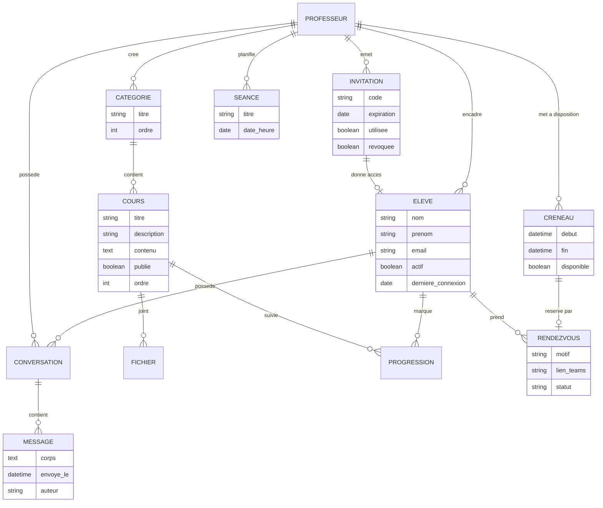

# Cahier des charges — Plateforme web e-learning pour apprenants seniors

Version 1.0 — 8 octobre 2026

Référence visuelle : dashboard "Coursue Learning Platform Dashboard" (Fireart Studio, Dribbble). Le style général (barre latérale, cartes arrondies, typographie lisible, espaces généreux) sert de base esthétique à la plateforme.

---

## 1. Présentation du projet

Un professeur d'informatique enseigne à des apprenants de 60 ans et plus. Il souhaite une plateforme web privée, accessible depuis un navigateur, qui regroupe ses cours, sa communication avec les élèves, son planning et ses publications.

La plateforme remplace les échanges dispersés (emails, papiers, appels) par un espace unique, simple et rassurant, adapté à un public qui découvre l'informatique ou souhaite être guidé pas à pas.

## 2. Contexte et publics

Trois publics sont concernés :

1. Le professeur, administrateur unique de la plateforme. Il crée, publie et organise tout le contenu.
2. Les élèves, apprenants seniors invités par le professeur. Ils consultent les cours, lisent le blog, échangent avec le professeur et prennent rendez-vous.
3. Les visiteurs non identifiés. Ils n'ont accès à rien : la plateforme est entièrement privée.

Contrainte de fond : le public a souvent une maîtrise limitée de l'informatique. Chaque écran doit être simple, explicite et sans jargon. Un élève doit atteindre n'importe quelle fonction en trois clics maximum depuis sa page d'accueil.

## 3. Objectifs

- Concentrer tous les supports de cours, les messages, les rendez-vous et les articles dans un seul espace sécurisé.
- Réserver l'accès aux élèves invités par le professeur.
- Permettre au professeur de gérer seul, sans compétence technique, l'intégralité du contenu.
- Adapter l'interface aux seniors : lisibilité, sobriété, repérage facile.
- Réduire la charge administrative du professeur (invitations, créneaux de rendez-vous, relances).

## 4. Périmètre

Inclus :

- Authentification des élèves et du professeur.
- Système d'invitation temporaire pour les élèves.
- Gestion des cours organisés en dossiers et sous-dossiers.
- Blog intégré servant de page d'accueil (dashboard).
- Messagerie privée professeur / élève.
- Calendrier des cours et des rendez-vous, avec prise de rendez-vous individuels.
- Rendez-vous par Microsoft Teams (la plateforme génère et héberge le lien, n'héberge pas la visioconférence).

Exclus :

- Paiement, facturation, abonnements.
- Messagerie entre élèves.
- Visioconférence intégrée (Teams est un service externe).
- Application mobile native (le site sera responsive).
- Notifications par SMS (notifications par email uniquement).

## 5. Rôles et permissions

| Fonction                                          | Élève             | Professeur (admin) |
| ------------------------------------------------- | ----------------- | ------------------ |
| Se connecter, consulter ses informations          | Oui               | Oui                |
| Lire les cours, le blog, le calendrier            | Oui               | Oui                |
| Envoyer un message au professeur                  | Oui               | Oui                |
| Répondre à un message d'un élève                  | Non               | Oui                |
| Prendre un rendez-vous sur un créneau libre       | Oui               | Oui                |
| Créer / modifier / supprimer un cours             | Non               | Oui                |
| Publier / modifier / supprimer un article de blog | Non               | Oui                |
| Modifier les dates des cours                      | Non               | Oui                |
| Définir ses disponibilités                        | Non               | Oui                |
| Créer / révoquer des invitations                  | Non               | Oui                |
| Annuler un rendez-vous                            | Le sien seulement | Tous               |
| Gérer les élèves (comptes)                        | Non               | Oui                |

## 6. Exigences fonctionnelles

### 6.1 Authentification et invitations (F1)

F1.1 — Page d'accueil publique. Un écran de connexion avec deux champs (email, mot de passe), un bouton "Se connecter" et un lien discret "Première visite ? Utilisez votre invitation". Aucun élément distrayant.

F1.2 — Invitation temporaire. Le professeur génère depuis son espace une invitation contenant soit un code à saisir, soit un lien unique. Chaque invitation est à usage unique.

F1.3 — Validité limitée. Une invitation expire après 2 jours (durée paramétrable par le professeur). Après expiration, le code ou le lien affiche un message clair : "Cette invitation a expiré. Contactez votre professeur."

F1.4 — Inscription en deux étapes. L'élève saisit son invitation, puis remplit un formulaire minimal : nom, prénom, email, mot de passe. Le mot de passe doit contenir au moins 8 caractères, des majuscules, des chiffres et au moins un caractère spécial. Un texte d'aide explique comment créer un mot de passe solide, avec un exemple.

F1.5 — Connexion du professeur. Le même écran de connexion, avec un lien "Espace professeur" qui ouvre une identification identique mais aboutit au dashboard administrateur. Le compte professeur est unique et créé à l'installation. Une authentification à deux facteurs par email (code à 6 chiffres) protège ce compte.

F1.6 — Réinitialisation du mot de passe. Lien "Mot de passe oublié" sur l'écran de connexion. Un email contenant un lien de réinitialisation valable 1 heure est envoyé.

F1.7 — Session. Déconnexion automatique après 30 minutes d'inactivité, avec un message d'avertissement 2 minutes avant ("Vous allez être déconnecté. Voulez-vous rester connecté ?"). Une case "Rester connecté sur cet appareil" prolonge la session de 30 jours sur les appareils personnels.

F1.8 — Révocation. Le professeur peut désactiver le compte d'un élève. L'élève déconnecté voit le message "Votre accès a été retiré. Contactez votre professeur."

F1.9 — Traçabilité. Chaque connexion enregistre la date et l'heure, visible par le professeur dans la fiche de l'élève.

### 6.2 Gestion des cours (F2)

F2.1 — Arborescence de dossiers. Les cours sont présentés sous forme de dossiers visuels, à la manière d'un explorateur de fichiers. Deux niveaux :

- Niveau 1 : la catégorie (ex. "Cours débutant", "Cours avancé"). Le professeur crée, renomme, réordonne et supprime librement les catégories.
- Niveau 2 : le cours unitaire (ex. "Cours 1 — Allumer et utiliser l'ordinateur", "Cours 2 — Naviguer sur Internet"). Chaque cours vit à l'intérieur d'une catégorie.

F2.2 — Vue élèves. L'élève ouvre la page "Cours", voit les dossiers de niveau 1 en grandes cartes avec icône et titre. Un clic ouvre le contenu du dossier : les cours de niveau 2 apparaissent en liste. Un second clic ouvre le cours.

F2.3 — Contenu d'un cours. Un cours contient :

- Un titre et une courte description.
- Un contenu rédigé (texte mis en forme : titres, listes, gras).
- Des fichiers joints (PDF, images, documents bureautiques), présentés en liste de téléchargement avec icône explicite ("Télécharger").
- Optionnel : un lien externe (vidéo YouTube, article).
- Optionnel : une case "Cours terminé" que l'élève peut cocher, pour suivre sa progression.

F2.4 — Progression. La page d'accueil de l'élève affiche sa progression dans la catégorie qu'il consulte le plus (ex. "4 cours sur 12 terminés").

F2.5 — Gestion professeur. Le professeur dispose d'un mode édition visible uniquement pour lui : boutons "Nouveau dossier", "Nouveau cours", "Modifier", "Supprimer" (avec confirmation), "Déplacer" un cours d'un dossier à l'autre. Le glisser-déposer est optionnel ; des boutons "Monter / Descendre" suffisent, plus rassurants qu'une manipulation fine.

F2.6 — Publication. Un cours peut être enregistré comme "visible par les élèves" ou "en préparation" (visible du seul professeur). Par défaut, un nouveau cours est en préparation.

F2.7 — Suppression sécurisée. Toute suppression demande une confirmation nommée ("Supprimer définitivement le dossier 'Cours débutant' ? Cette action est irréversible.").

### 6.3 Blog d'accueil / dashboard (F3)

F3.1 — Le dashboard est un blog. La page sur laquelle toute personne connectée arrive est le blog du professeur. Les derniers articles s'affichent en cartes : image ou illustration, titre, date, chapô de deux lignes, bouton "Lire l'article".

F3.2 — Contenu éditorial. Articles sur les nouvelles technologies (guides, actualités vulgarisées) et guides d'utilisation d'Internet (rechercher, reconnaître une arnaque, utiliser sa messagerie, etc.).

F3.3 — Article complet. Titre, date, image d'illustration, texte mis en forme, fichiers attachés éventuels. En pied d'article : "Publié par \[nom du professeur\]" et un bouton "Retour aux articles".

F3.4 — Rédaction professeur. Éditeur simple avec mise en forme de base (titre, gras, listes, liens, images par téléchargement). Champs : titre, image d'illustration (optionnelle), contenu, statut (brouillon / publié). Enregistrement automatique toutes les 60 secondes.

F3.5 — Navigation latérale. Le dashboard reprend la structure visuelle de la référence : une barre latérale permanente avec quatre entrées — Accueil (blog), Mes cours, Messages, Calendrier — plus, pour le professeur, son module d'administration. Le nom et l'avatar de l'utilisateur ainsi qu'un bouton "Se déconnecter" restent visibles en bas de la barre.

F3.6 — Réorganisation. Les articles publiés s'affichent par ordre antichronologique. Le professeur peut épingler un article ("À la une") qui s'affiche en tête.

### 6.4 Messagerie professeur / élève (F4)

F4.1 — Conversations privées uniquement. Chaque élève possède une conversation unique avec le professeur. Aucune communication entre élèves n'est possible : la messagerie n'offre pas de recherche d'autres destinataires.

F4.2 — Vue élèves. Page "Messages" : historique de la conversation déroulant, champ de saisie en bas, bouton "Envoyer" (grand et visible). Les messages du professeur se distinguent visuellement (bulle et couleur différentes).

F4.3 — Vue professeur. Page "Messages" affichant la liste de toutes les conversations avec, pour chacune, le nom de l'élève, le dernier message, sa date et un indicateur de message non lu. Un clic ouvre la conversation complète.

F4.4 — Fonctions de base. Envoi de texte, suppression de son propre message (possible dans les 5 minutes, avec confirmation), pièces jointes (images, PDF, 10 Mo maximum par fichier).

F4.5 — Notifications. Un point rouge apparaît sur l'entrée "Messages" de la barre latérale lors d'un message non lu. Un email est envoyé au destinataire pour l'informer d'un nouveau message, avec un lien direct vers la conversation.

F4.6 — Modération. Le professeur peut supprimer n'importe quel message d'un élève si nécessaire.

### 6.5 Calendrier et rendez-vous (F5)

F5.1 — Calendrier partagé. Vue calendrier mensuelle (avec possibilité de basculer en semaine) affichant :

- Les dates des cours (créés par le professeur), visibles par tous.
- Les rendez-vous individuels, visibles uniquement par le professeur et l'élève concerné.

F5.2 — Créneaux de disponibilité. Le professeur définit ses disponibilités : plages horaires récurrentes (ex. "mardi et jeudi, 14h–17h") et exceptions (dates bloquées, vacances). Une disponibilité peut être un créneau individuel de 30 ou 60 minutes.

F5.3 — Prise de rendez-vous par l'élève. L'élève ouvre le calendrier, voit les créneaux libres (affichés en vert, avec le mot "Disponible"), choisit un créneau, et confirme dans une fenêtre simple : "Confirmer le rendez-vous du mardi 14 octobre à 14h30 ?" avec le motif optionnel (ex. "Révision du cours 3").

F5.4 — Verrouillage du créneau. Dès confirmation, le créneau devient indisponible pour tous les autres élèves et disparaît de leur vue. Seuls le professeur et l'élève inscrit voient le rendez-vous sur le calendrier (avec le nom de l'élève pour le professeur, "Rendez-vous" pour l'élève).

F5.5 — Rendez-vous par Teams. Le professeur associe un lien Microsoft Teams au rendez-vous (généré via la réunion Teams planifiée par ailleurs, puis collé dans la plateforme). Le lien Teams apparaît sur le rendez-vous, visible par le professeur et l'élève concerné. Option : champ "Lien Teams" que le professeur remplit. Un email de confirmation contient ce lien. 24 heures avant, un email de rappel est envoyé aux deux parties.

F5.6 — Modification et annulation. Le professeur peut déplacer ou annuler tout rendez-vous : les élèves concernés reçoivent un email automatique. Un cours peut changer de date : le professeur édite la date, la nouvelle s'affiche immédiatement pour tous, et un email informe les élèves.

F5.7 — Annulation par l'élève. L'élève peut annuler son propre rendez-vous jusqu'à 24 heures avant. Le créneau redevient alors disponible pour les autres. Moins de 24 heures avant, l'élève doit passer par la messagerie pour demander l'annulation.

F5.8 — Limites. Un élève ne peut pas avoir plus d'un rendez-vous à venir à la fois (paramétrable par le professeur).

F5.9 — Vue professeur du calendrier. Filtres : "Tout", "Cours", "Rendez-vous", "Disponibilités". Vue du jour en liste pour un aperçu rapide.

### 6.6 Module d'administration professeur (F6)

F6.1 — Gestion des élèves. Liste des comptes : nom, email, date d'inscription, dernière connexion, nombre de rendez-vous. Actions : désactiver, réactiver, supprimer (avec confirmation).

F6.2 — Gestion des invitations. Création d'une invitation (génération d'un code et d'un lien), liste des invitations en attente avec date d'expiration, action "Renvoyer l'email", action "Révoquer". L'invitation contient les instructions pas à pas pour s'inscrire, rédigées simplement.

F6.3 — Paramètres. Durée de validité des invitations, durée des créneaux, nombre de rendez-vous simultanés autorisés par élève, messages d'accueil personnalisables.

## 7. Exigences d'interface et d'accessibilité

L'objectif esthétique s'inspire du dashboard Coursue : barre latérale fixe, cartes arrondies, grands titres, illustrations sobres, palette claire et apaisante.

7.1 — Lisibilité senior. Police de base de 18 px minimum, bouton "A+" et "A–" permanent pour ajuster la taille du texte. Interlignage généreux. Contrastes conformes au niveau AA du WCAG 2.1 (ratio 4,5:1 minimum pour le texte).

7.2 — Simplicité. Maximum de quatre entrées dans la barre latérale côté élèves. Vocabulaire courant : "Mes cours" et non "Catalogue pédagogique". Chaque action destructrice demande une confirmation en français clair.

7.3 — Feedback permanent. Après chaque action (envoi d'un message, prise de rendez-vous), un message de confirmation s'affiche : "Votre message a bien été envoyé." Les erreurs s'affichent en français compréhensible ("L'invitation saisie n'est pas valide. Vérifiez les caractères.").

7.4 — Navigation cohérente. La barre latérale ne change jamais de place. Le fil d'Ariane indique où l'on se trouve dans les dossiers de cours ("Cours débutant &gt; Cours 3 &gt; Supports").

7.5 — Responsive. Utilisation confortable sur tablette et ordinateur. L'application n'est pas conçue en priorité pour mobile, mais reste lisible sur smartphone (barre latérale repliable en menu).

7.6 — Temps de chargement. Chaque page s'affiche en moins de 3 secondes sur une connexion standard.

7.7 — Aide intégrée. Un bouton "Aide" permanent ouvre un guide court et illustré de l'utilisation de la plateforme (comment se connecter, lire un cours, prendre un rendez-vous, écrire au professeur).

## 8. Exigences techniques

8.1 — Architecture. Application web à trois couches : interface front-end (SPA responsive), API back-end, base de données relationnelle. Suggestion de pile technologique :

- Front-end : React ou Next.js, avec une bibliothèque de composants (ex. shadcn/ui) permettant d'atteindre l'esthétique Coursue rapidement.
- Back-end : Node.js (Express/NestJS) ou Python (Django). Django offre nativement l'administration, l'authentification et les permissions, adapté à un projet mené par une personne seule.
- Base de données : PostgreSQL.
- Fichiers : stockage objet (S3 ou équivalent).
- Emails : service transactionnel (Brevo, Postmark ou équivalent) ou tout type de mailing gratuit.

8.2 — Sécurité.

- Mots de passe hachés (bcrypt ou équivalent).
- HTTPS obligatoire sur tout le site.
- Protection contre les injections SQL, XSS et CSRF.
- Limitation des tentatives de connexion (verrouillage temporaire après 5 échecs).
- Sessions signées et expiration côté serveur.
- Sauvegardes quotidiennes automatiques, conservation 30 jours.

8.3 — RGPD et données personnelles.

- Données collectées : nom, prénom, email, messages, rendez-vous. Aucune donnée superflue.
- Hébergement des données dans l'Union européenne.
- Droit d'accès, de rectification et de suppression : traité par le professeur via la gestion des comptes ; procédure écrite dans les mentions légales.
- Mentions légales et politique de confidentialité accessibles depuis l'écran de connexion.

8.4 — Volumétrie attendue. 1 compte professeur, 20 à 50 comptes élèves, quelques centaines de messages, 30 à 100 rendez-vous par an, 5 Go de stockage de fichiers maximum. Dimensionnement modeste : un hébergement mutualisé ou une petite instance cloud suffisent.

8.5 — Maintenance. Interface d'administration du professeur suffisante pour toute la gestion courante. Aucune intervention technique nécessaire pour publier un cours, un article, une invitation ou un créneau.

## 9. Modèle de données

## 10. Parcours utilisateurs de référence

### Parcours 1 — Premier accès d'un élève

1. L'élève reçoit l'email d'invitation contenant le lien et les instructions.
2. Il clique sur le lien, saisit ses nom, prénom, email et choisit un mot de passe.
3. Il arrive sur le dashboard : le dernier article du professeur s'affiche, avec un encart de bienvenue.
4. Il clique sur "Mes cours", ouvre le dossier "Cours débutant", puis le "Cours 1".

### Parcours 2 — Prise de rendez-vous

1. L'élève clique sur "Calendrier".
2. Les créneaux libres apparaissent en vert. Il clique sur celui du jeudi 16 octobre à 15h.
3. Fenêtre de confirmation : il choisit le motif "Aide sur le cours 4" et confirme.
4. Le créneau disparaît pour les autres élèves. L'élève voit son rendez-vous marqué "Rendez-vous".
5. Le professeur voit "Rendez-vous avec \[nom de l'élève\]", y colle le lien Teams.
6. Les deux parties reçoivent l'email de confirmation, puis le rappel 24 heures avant.

### Parcours 3 — Publication d'un article

1. Le professeur clique sur "Administration" puis "Articles".
2. Il crée un article : titre "Reconnaître un email frauduleux", image, contenu, statut "Publié".
3. L'article apparaît immédiatement en tête du blog des élèves.

### Parcours 4 — Changement de date d'un cours

1. Le professeur ouvre "Calendrier", clique sur la séance du 14 octobre.
2. Il modifie la date au 21 octobre et enregistre.
3. Tous les élèves voient la nouvelle date ; un email les informe automatiquement.

## 11. Livrables et phases

Phase 0 — Cadrage : validation du présent cahier des charges, maquettes des écrans principaux (connexion, dashboard, cours, calendrier). Durée indicative : 2 semaines.

Phase 1 — Fondations : authentification, invitations, rôles, structure de la barre latérale et du dashboard vide. 3 semaines.

Phase 2 — Cours : arborescence des dossiers, contenu des cours, gestion professeur, progression élève. 3 semaines.

Phase 3 — Blog : articles, rédaction, affichage. 2 semaines.

Phase 4 — Messagerie : conversations, notifications email. 2 semaines.

Phase 5 — Calendrier : disponibilités, rendez-vous, lien Teams, emails de rappel. 3 semaines.

Phase 6 — Recette et mise en ligne : tests avec 3 à 5 élèves pilotes de plus de 60 ans, corrections d'accessibilité, hébergement, sauvegardes, formation du professeur. 2 semaines.

Chaque phase se conclut par une démonstration au professeur et une liste de corrections.

## 12. Critères d'acceptation

Le projet est accepté lorsque les points suivants sont vérifiés :

1. Aucune page n'est accessible sans connexion ; une invitation expirée ou utilisée est refusée avec un message clair.
2. Un élève ne voit que ses propres messages et ses propres rendez-vous ; il ne peut écrire qu'au professeur.
3. Un créneau réservé par un élève n'est plus proposé aux autres.
4. La suppression d'un dossier de cours demande une confirmation et n'est possible que par le professeur.
5. Un article en brouillon n'est visible que du professeur.
6. Le changement de date d'une séance est répercuté chez tous les élèves et notifié par email.
7. Le site respecte le niveau AA WCAG 2.1 sur les contrastes et le texte reste lisible à 18 px minimum.
8. L'ensemble des parcours utilisateurs de la section 10 se déroule sans erreur.
9. Les sauvegardes quotidiennes sont opérationnelles et une restauration a été testée.
10. Un élève pilote de plus de 60 ans, jamais invité sur la plateforme, parvient seul à : se connecter, lire un article, ouvrir un cours, écrire un message et prendre un rendez-vous, sans aide extérieure.

## 13. Glossaire

Dashboard : la page d'accueil après connexion, présentant le blog du professeur.  
Invitation temporaire : code ou lien unique permettant à une personne de créer un compte élève, valable 2 jours (durée paramétrable par le professeur).  
Créneau : plage horaire où le professeur est disponible pour un rendez-vous.  
Séance : date d'un cours collectif programmé par le professeur.  
WCAG : recommandations internationales d'accessibilité du web, garantissant la lisibilité pour tous.  
SPA : application web monopage dont l'interface se rafraîchit sans rechargement complet.
